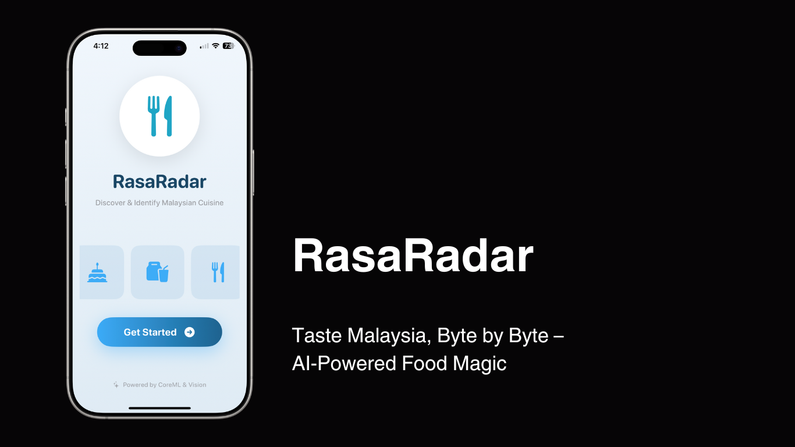
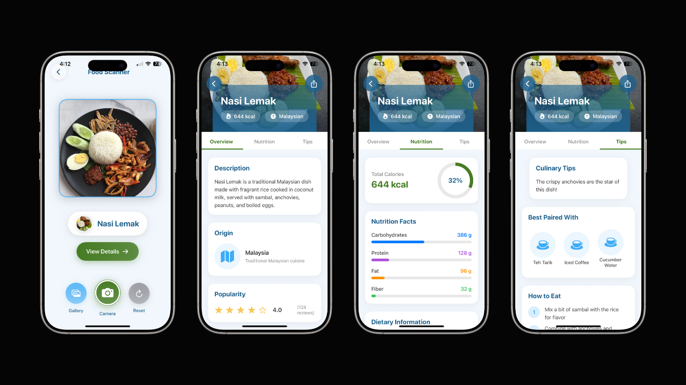
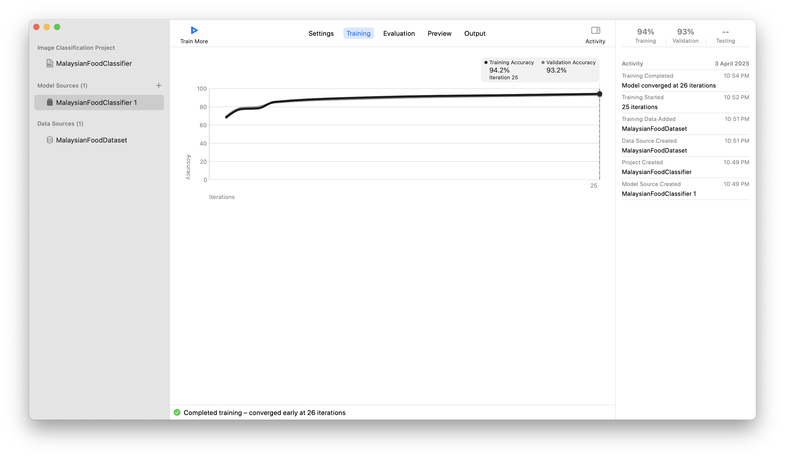

# RasaRadar

RasaRadar is an iOS application that helps users discover and classify Malaysian foods using CoreML and Vision frameworks. The app allows users to capture images of food, classify them using a machine learning model, and view detailed information about the identified food.



## Features

- **Food Classification**: Classify Malaysian foods using a CoreML model (`MalaysianFoodClassifier.mlmodel`).
- **Camera Integration**: Capture food images directly within the app using the device's camera.
- **Food Information**: View detailed information about the classified food, including calories and a description.
- **Modern UI**: A clean and intuitive user interface built with SwiftUI.

## Screenshots



## Supported Food Categories

The app can currently identify the following Malaysian foods:

- Kaya Toast
- Laksa
- Nasi Lemak
- Popiah
- Roti Canai
- Satay

## Key Files

- **`ContentView.swift`**: The main entry point of the app, providing navigation to the `ProcessView`.
- **`ProcessView.swift`**: Handles the camera integration, food classification, and navigation to the `FoodInfoView`.
- **`CameraCaptureView.swift`**: Implements the camera functionality using `UIViewControllerRepresentable` and integrates with Vision for image classification.
- **`FoodInfoView.swift`**: Displays detailed information about the classified food, including its name, calories, and description.
- **`MalaysianFoodClassifier.mlmodel`**: The CoreML model used for food classification.

## Requirements

- iOS 16.0 or later
- Xcode 14.0 or later
- Swift 5.0 or later

## Setup Instructions

1. Clone the repository:
   ```bash
   git clone https://github.com/YOUR_USERNAME/RasaRadar.git
   cd RasaRadar
   ```

2. Open the project in Xcode:
   ```bash
   open RasaRadar.xcodeproj
   ```

3. Ensure the `MalaysianFoodClassifier.mlmodel` file is included in the project.

4. Build and run the app on a simulator or physical device.

## Usage

1. Launch the app.
2. Tap "Let's Start!" to navigate to the `ProcessView`.
3. Use the "Scan Food" button to capture an image of the food.
4. View the classification result and tap "View Food Info" to see detailed information about the food.

## Model Performance

The `MalaysianFoodClassifier.mlmodel` was trained using Apple's Create ML framework with the Malaysian Food Dataset. The training process achieved the following results:



- **Training Accuracy**: 94.2%
- **Validation Accuracy**: 93.2%
- **Iterations**: The model converged early at 26 iterations.

## Permissions

The app requires camera access to capture food images. The necessary permissions are included in the `Info.plist` file:

```xml
<key>NSCameraUsageDescription</key>
<string>This app requires camera access to scan food items.</string>
```

## Contributing

Contributions are welcome! Please feel free to submit a Pull Request.

## License

This project is licensed under the MIT License. See the `LICENSE` file for details.

## Acknowledgments

- [Malaysian Food Dataset](https://www.kaggle.com/datasets/karkengchan/malaysia-food-11)
- CoreML and Vision frameworks for enabling machine learning and image processing.
- SwiftUI for building a modern and responsive user interface.

---

**Created with ❤️ by Fakhrul Fauzi for Malaysian food enthusiasts**
